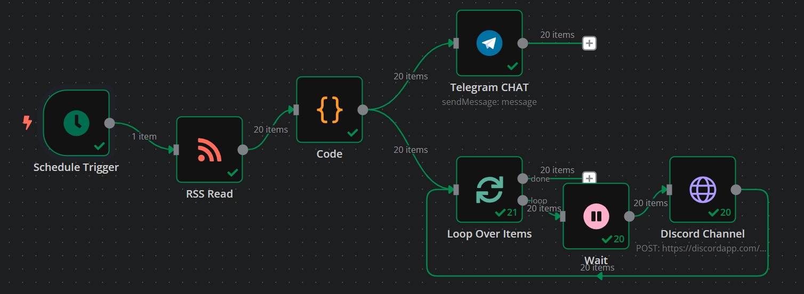
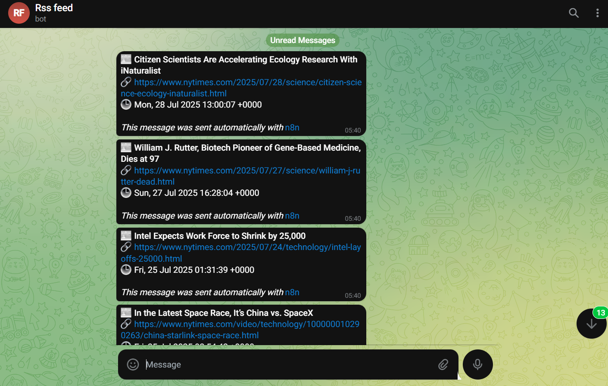
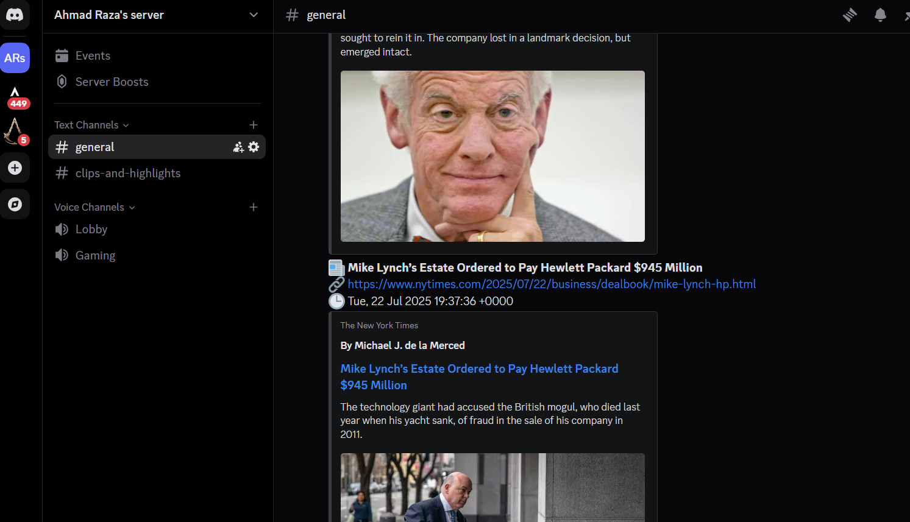

# 📡 RSS to Telegram & Discord Bot – n8n Workflow

This project provides a robust n8n workflow that automatically fetches the latest items from any RSS feed and delivers formatted alerts to both **Telegram** and **Discord** in real-time. Built entirely with n8n, this solution requires no additional code dependencies, making it accessible and easy to deploy.

> ✅ Powered by [n8n](https://n8n.io)  
> 🔁 Automated via Cron or RSS polling  
> 📬 Dual-platform delivery: **Telegram Bot** + **Discord Webhook**

---

## 🚀 Features

- **RSS Feed Integration**: Pulls the latest items from any valid RSS feed URL.
- **Custom Message Formatting**: Formats posts with emojis, titles, and links for clear, engaging alerts.
- **Dual-Platform Alerts**:
  - Sends messages to a Telegram user, group, or channel.
  - Posts to a Discord channel via webhook.
- **Rate Limiting**: Ensures compliance with API restrictions to prevent bans or throttling.
- **Customizable**: Easily modify the workflow to suit specific feeds or formatting needs.
- **No-Code Solution**: Built 100% in n8n without requiring custom scripts.

---

## 📂 Repository Structure

| File                          | Description                                      |
|-------------------------------|--------------------------------------------------|
| `rss-to-telegram-discord.json`| n8n workflow export file                         |
| `README.md`                   | Project guide, overview, and setup instructions  |
| `screenshots/`                | Screenshots of workflow and bot outputs          |

---

## 🔧 Tools Used

- **n8n**: Self-hosted automation platform for workflow orchestration.
- **Telegram Bot API**: For sending messages to Telegram users or groups.
- **Discord Webhooks**: For posting messages to Discord channels.
- **RSS Feed Read Node**: To fetch and parse RSS feed data.
- **Function + HTTP Request Nodes**: For message formatting and API interactions.

---

## 📸 Workflow Preview

Below are example screenshots of the workflow and bot outputs:

1. **n8n Workflow Layout**  
     
   *The complete n8n workflow showing RSS polling, formatting, and delivery nodes.*

2. **Telegram Message Output**  
     
   *Formatted message with emoji, title, and link sent to a Telegram group.*

3. **Discord Message Output**  
     
   *Formatted post delivered to a Discord channel via webhook.*

> *Note*: Replace placeholder screenshot paths (`screenshots/*.png`) with actual images after capturing them.

---

## 📥 Installation

Follow these steps to set up the workflow:

1. **Clone the Repository**  
   Clone this repository or download the `rss-to-telegram-discord.json` file.

2. **Import into n8n**  
   - Open your n8n instance.
   - Go to **Workflows** > **Import from File**.
   - Upload the `rss-to-telegram-discord.json` file.

3. **Configure Credentials**  
   - **Telegram Bot Token**: Create a Telegram bot via [BotFather](https://t.me/BotFather) and add the token to n8n credentials.
   - **Discord Webhook URL**: Create a webhook in your Discord server and add the URL to n8n credentials.

4. **Set RSS Feed URL**  
   - Update the RSS Feed Read node with your desired RSS feed URL (e.g., a blog, news site, or other feed).

5. **Test and Activate**  
   - Execute the workflow manually to verify setup.
   - Enable a Cron trigger for scheduled polling or use the RSS node's built-in polling.

---

## ✨ Use Cases

- **Personal News Alerts**: Stay updated with news from your favorite RSS feeds.
- **Blog Syndication**: Share blog updates with your community on Telegram and Discord.
- **Team Notifications**: Deliver company updates or project news to team channels.
- **Market Monitoring**: Get real-time alerts for crypto, NFT, or stock market feeds.

---

## 🧠 Author

**Ahmad Raza**

- 💼 **Fiverr**: [fiverr.com/nitrola](https://www.fiverr.com/nitrola)
- 👨‍💼 **LinkedIn**: [linkedin.com/in/ahmad-raza-403bbd0278](https://www.linkedin.com/in/ahmad-raza-403bbd0278)
- 🌐 **Portfolio**: Coming Soon

---

## 🏷️ Tags

`#n8n` `#automation` `#rss` `#telegrambot` `#discordwebhook` `#workflowautomation` `#opensource` `#nocode` `#integration` `#saadtahir`

---

## 📝 License

This project is licensed under the [MIT License](LICENSE). Feel free to reuse, modify, and share!
